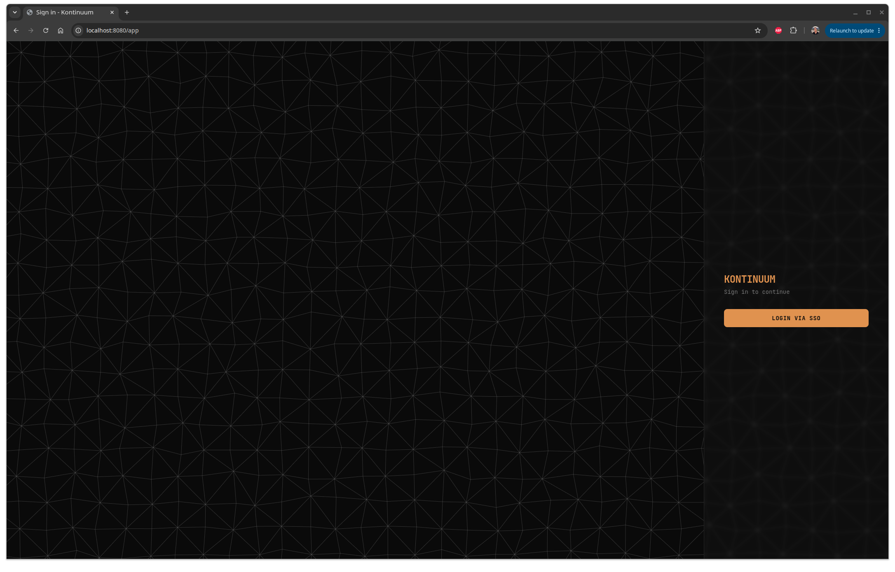
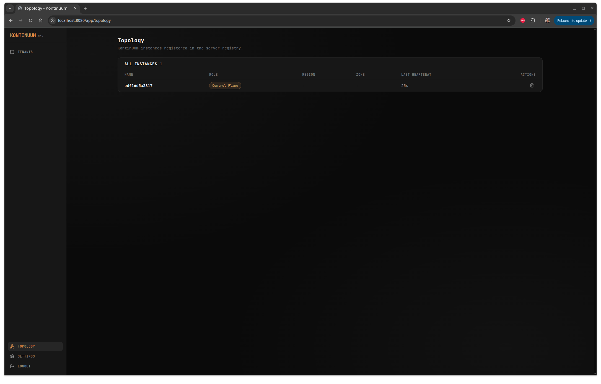
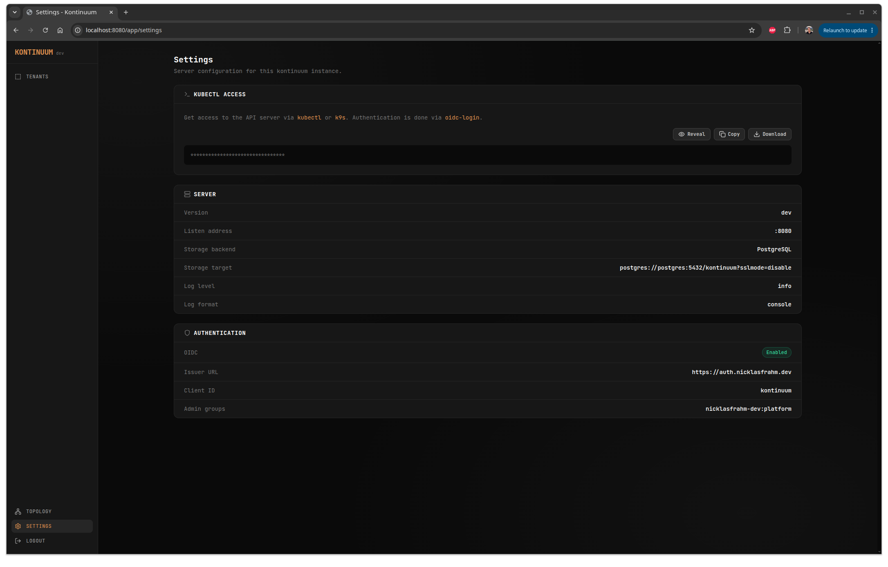

# Kontinuum

A Kubernetes-style API server built on [kommodity](https://github.com/kommodity-io/kommodity)'s `libkapi` package. It embeds a generic apiserver + apiextensions (CRD) server + aggregation layer, backed by pluggable storage (SQLite, PostgreSQL, etcd, ...).

  { width="32%" }
  { width="32%" }
  { width="32%" }

!!! warning
    The server ships with no TLS by default. Put a TLS-terminating proxy in front before exposing it outside a trusted network. Authentication must be configured deliberately — see [Authentication](authentication.md).

## Where to go next

- [**Architecture**](architecture.md) — how the server, controllers, and UI fit together.
- [**Running via Docker**](running-via-docker.md) — the fastest way to try kontinuum, no Go toolchain required.
- [**Authentication**](authentication.md) — the OIDC/PKCE login flow, anonymous access, and how to turn each on.
- [**Cluster provisioning**](workflows/cluster-provisioning.md) — how kontinuum turns bare-metal machines into a running Talos Kubernetes cluster.
- [**Contribution guidelines**](contributing.md) — conventions for contributing to kontinuum.
- [**Local setup**](local-setup.md) — build kontinuum from source and run the hot-reload dev environment.
- [**API reference**](reference.md) — the CRDs and configuration variables that make up kontinuum's API, and the generated field reference.

## What kontinuum is for

Kontinuum manages `Instance`, `InstancePool`, and `TalosCluster` custom resources through a Kubernetes-style API of its own — the same `kubectl`-compatible interface you'd use against a real cluster — to discover machines, claim them into pools, and bootstrap Talos Kubernetes clusters on top of them, with Cilium and cert-manager installed as addons. See [Architecture](architecture.md) for how the pieces fit together.
