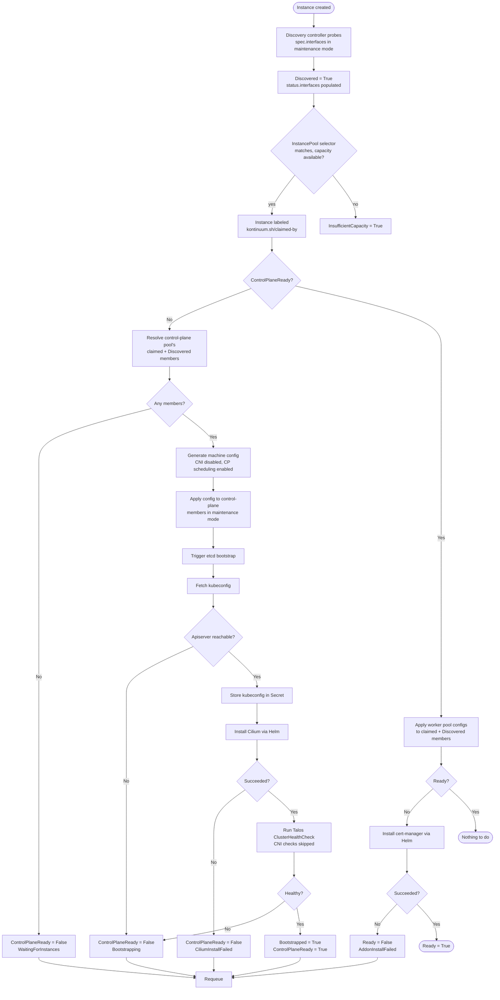

# Cluster provisioning

Kontinuum turns bare-metal (or provider) machines into a running, Cilium-
and cert-manager-equipped Talos Kubernetes cluster through four cooperating
controllers, each owning one CRD's reconcile loop:

`Instance` discovery → `InstancePool` claiming → `TalosCluster` bootstrap →
addon install.

See [issue #24](https://github.com/nicklasfrahm-dev/kontinuum/issues/24) for
the architecture decisions behind this design, and #27/#28 for the two
implementation phases these controllers shipped in.

## Stages

### 1. Instance discovery (`pkg/domain/instance`)

An `Instance` object lists candidate `spec.interfaces` addresses. The
discovery controller dials each in Talos maintenance mode (insecure TLS,
port 50000) and, on the first successful probe, records the node's Talos
version and discovered network interfaces in `status`, setting the
`Discovered` condition true. Discovery and claiming are independent
concerns — an `Instance` can be claimed before it's ever been discovered.

### 2. InstancePool claiming (`pkg/domain/instancepool`)

An `InstancePool` selects candidate `Instance`s via `spec.selector` and
claims up to `spec.replicas` of them by setting the `kontinuum.sh/claimed-by`
label. Claiming is a conditional (CAS) update — `Get`, label, `Update` — so
two pools racing for the same candidate can't both win; a resourceVersion
conflict just skips that candidate. Claims are sticky: only a scale-down
(claimed count exceeding `spec.replicas`) releases the excess, in
deterministic (name-sorted) order. `status.readyReplicas` counts claimed
instances that are also `Discovered`.

### 3. TalosCluster bootstrap and addons (`pkg/domain/taloscluster`)

A `TalosCluster` references a control-plane `InstancePool` and, optionally,
one or more worker `InstancePool`s (`spec.workers[]`). Its reconciler is a
state machine driven entirely by `status.conditions`
(`ControlPlaneReady` → `Bootstrapped` → `Ready`) — see the flow chart below.

Every step past machine-config generation is best-effort and idempotent: a
maintenance-mode call against a node that's already moved past maintenance
mode is *expected* to fail, and is logged rather than treated as fatal —
Talos's own `ClusterHealthCheck` is the real convergence gate, and the
reconciler simply retries on the next tick.

#### Why Cilium installs before the cluster is "healthy"

Talos's `ClusterHealthCheck` waits for CoreDNS to report ready, which
itself needs a working pod network. If Cilium only installed *after* a
passing health check, nothing would ever provide that network in the first
place — a deadlock. Kontinuum breaks the cycle two ways:

- Talos's own default CNI (flannel) is disabled (`CNIName: none`) at
  machine-config-generation time, so the health check *skips* the
  network-dependent checks entirely instead of waiting on a CNI that was
  never configured.
- Cilium is installed as soon as the apiserver is reachable — gated on a
  successful kubeconfig fetch, not on cluster health.

cert-manager has no such dependency, so it installs normally, after
`ControlPlaneReady`.

#### Timeouts

Every blocking call in this pipeline — every Talos gRPC RPC and both Helm
installs — has an explicit client-side timeout. Talos's own
`ClusterHealthCheck` request carries a `waitTimeout` field, but that only
bounds the *server's* internal retry loop, not the client call; without an
explicit `context.WithTimeout` on the client side too, a stalled server or
a slow chart fetch could block a reconcile indefinitely. A bounded failure
is just another retry on the next tick — safe and expected — where an
unbounded hang is not.

## Flow chart

