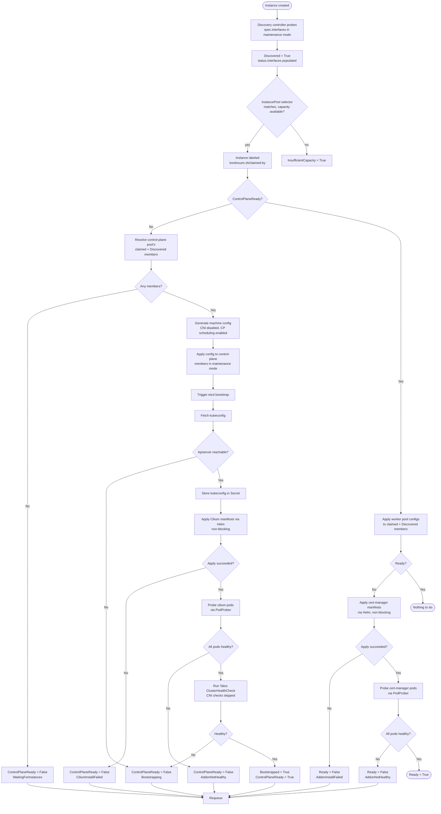

# Cluster provisioning

Kontinuum turns bare-metal (or provider) machines into a running, Cilium-
and cert-manager-equipped Talos Kubernetes cluster through four cooperating
controllers, each owning one CRD's reconcile loop:

`Instance` discovery → `InstancePool` claiming → `TalosCluster` bootstrap →
addon install.

See [issue #24](https://github.com/nicklasfrahm-dev/kontinuum/issues/24) for
the architecture decisions behind this design, and #27/#28 for the two
implementation phases these controllers shipped in.

## Stages

1. **Instance discovery** (`pkg/domain/instance`) — an `Instance` object
   lists candidate `spec.interfaces` addresses. The discovery controller
   dials each in Talos maintenance mode (insecure TLS, port 50000) and, on
   the first successful probe, records the node's Talos version and
   discovered network interfaces in `status`, setting the `Discovered`
   condition true. Discovery and claiming are independent concerns — an
   `Instance` can be claimed before it's ever been discovered.
2. **InstancePool claiming** (`pkg/domain/instancepool`) — an
   `InstancePool` selects candidate `Instance`s via `spec.selector` and
   claims up to `spec.replicas` of them by setting the
   `kontinuum.sh/claimed-by` label. Claiming is a conditional (CAS) update
   — `Get`, label, `Update` — so two pools racing for the same candidate
   can't both win; a resourceVersion conflict just skips that candidate.
   Claims are sticky: only a scale-down (claimed count exceeding
   `spec.replicas`) releases the excess, in deterministic (name-sorted)
   order. `status.readyReplicas` counts claimed instances that are also
   `Discovered`.
3. **TalosCluster bootstrap and addons** (`pkg/domain/taloscluster`) — a
   `TalosCluster` references a control-plane `InstancePool` and,
   optionally, one or more worker `InstancePool`s (`spec.workers[]`). Its
   reconciler is a state machine driven entirely by `status.conditions`
   (`ControlPlaneReady` → `Bootstrapped` → `Ready`) — see the
   [flow chart](#flow-chart) below and [Bootstrap details](#bootstrap-details)
   for the reasoning behind it.

Every step past machine-config generation is best-effort and idempotent: a
maintenance-mode call against a node that's already moved past maintenance
mode is *expected* to fail, and is logged rather than treated as fatal —
Talos's own `ClusterHealthCheck` is the real convergence gate, and the
reconciler simply retries on the next tick.

## Bootstrap details

### Why Cilium installs before the cluster is "healthy"

Talos's `ClusterHealthCheck` waits for CoreDNS to report ready, which
itself needs a working pod network. If Cilium only installed *after* a
passing health check, nothing would ever provide that network in the first
place — a deadlock. Kontinuum breaks the cycle two ways:

- Talos's own default CNI (flannel) is disabled (`CNIName: none`) at
  machine-config-generation time, so the health check *skips* the
  network-dependent checks entirely instead of waiting on a CNI that was
  never configured.
- Cilium is installed as soon as the apiserver is reachable — gated on a
  successful kubeconfig fetch, not on cluster health.

cert-manager has no such dependency, so it installs normally, after
`ControlPlaneReady`.

### `cilium-operator` runs a single replica

The Cilium chart defaults `operator.replicas` to `2` (for HA) alongside
`operator.hostNetwork: true`, which makes the operator's prometheus
`containerPort` an implicit hostPort. Every `TalosCluster` this reconciler
bootstraps today is single-node (`AllowSchedulingOnControlPlanes: true` in
`config.go`), so a second replica can never be scheduled — it fails
permanently with `0/1 nodes are available: ... didn't have free ports for
the requested pod ports`, which looks identical to a genuine hang from
`PodProber`'s point of view: bare `Pending` that never resolves. `addons.go`
pins `operator.replicas` to `1` to avoid this — the chart's own
`values.yaml` documents the clash directly: "In HA mode, cilium-operator
pods must not be scheduled on the same node as they will clash with each
other".

### Cilium values follow Talos's own guide, not just the chart's defaults

`addons.go`'s `ciliumValues` deviates from the chart's own defaults in
several places, matching Talos's documented Cilium install
(docs.siderolabs.com/kubernetes-guides/cni/deploying-cilium) rather than
values chosen ad hoc:

- `k8sServiceHost`/`k8sServicePort` point at `localhost:7445` — Talos's own
  KubePrism apiserver proxy, which every node runs locally — instead of a
  specific control-plane member's address. With kube-proxy disabled, Cilium
  can't discover the apiserver any other way; KubePrism means this doesn't
  depend on a real control-plane load balancer existing.
- `securityContext.capabilities` pins the agent and `clean-cilium-state`
  init container to Talos's reduced capability sets rather than the
  chart's broader defaults. The chart's own defaults for
  `clean-cilium-state` aren't fully grantable under Talos's container
  runtime constraints, surfacing as `OCI runtime create failed: ... unable
  to apply caps: can't apply capabilities: operation not permitted` and a
  permanent `CrashLoopBackOff`.
- `cgroup.autoMount.enabled` is disabled, with `cgroup.hostRoot` pointed at
  Talos's own cgroup2 mount, since Talos already provides one — Cilium's
  own redundant auto-mount attempt inside the init container is both
  unnecessary and another likely source of the same capability failure.
- `ipam.mode` is set to `kubernetes`, so Cilium reads pod CIDRs from each
  Node's own spec instead of running its own allocator.

### Pod health is probed separately from the Helm apply

The Helm install/upgrade calls (`installRelease`/`upgradeRelease`) are
deliberately non-blocking — no `Wait`/`WaitForJobs` — so they return as
soon as manifests are applied, not once pods actually start. Whether an
addon is actually usable is checked afterward, by `PodProber`, on a later
reconcile: `ControlPlaneReady` doesn't go true until Cilium's own pods
report healthy, and `Ready` doesn't go true until cert-manager's do. This
matches the rest of the reconciler's own self-healing, non-blocking style
(`ApplyConfiguration`/`Bootstrap` don't block for completion either) rather
than tying up a reconcile — and, on a manager with few concurrent workers,
potentially other objects' reconciles too — for however long a cold
rollout takes.

"Healthy" means every pod in the addon's namespace is either `Running`
with its `PodReady` condition true, or `Succeeded` — a completed one-shot
Job pod (e.g. cert-manager's own `startupapicheck`) is expected, not a
failure.

### Timeouts

Every blocking call in this pipeline — every Talos gRPC RPC and both Helm
installs — has an explicit client-side timeout. Talos's own
`ClusterHealthCheck` request carries a `waitTimeout` field, but that only
bounds the *server's* internal retry loop, not the client call; without an
explicit `context.WithTimeout` on the client side too, a stalled server or
a slow chart fetch could block a reconcile indefinitely. A bounded failure
is just another retry on the next tick — safe and expected — where an
unbounded hang is not.

## Flow chart

