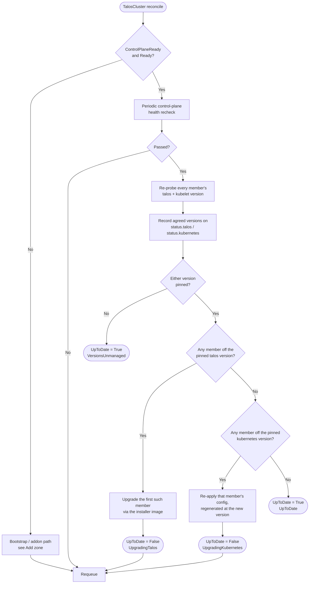

# Upgrade a cluster

A `TalosCluster` pins the Talos and Kubernetes versions its members run:

```yaml
spec:
  talos:
    version: v1.13.0
  kubernetes:
    version: v1.32.0
```

Editing either field is all it takes to upgrade. The `taloscluster`
controller rolls the cluster's members onto the new version one at a time,
waiting for the cluster to be healthy again between each one, and reports
progress on the cluster's own `UpToDate` condition.

## Try it

```sh
export KUBECONFIG=kontinuum.yaml
kubectl patch taloscluster eu-eu-1a -n kontinuum-system --type merge \
  -p '{"spec":{"talos":{"version":"v1.13.1"}}}'
```

Then watch it converge:

```sh
kubectl get taloscluster eu-eu-1a -n kontinuum-system -w
```

The same edit is available from the UI: the cluster detail page's **Upgrade
cluster** button opens a dialog with both version fields, showing what each
one is currently running underneath.

## Rules

### An empty version is unmanaged, not "latest"

Leaving `spec.talos.version` or `spec.kubernetes.version` empty means
kontinuum does not manage that version at all — it will never upgrade a
member toward a version nobody asked for. The controller still needs *some*
version to generate machine configs with, and falls back to its own pinned
default for exactly that, but that default never drives an upgrade.

Clearing a version that was previously set stops kontinuum managing it from
that point on. It does not roll anything back.

### Talos takes precedence over Kubernetes

If a single edit moves both versions, the whole cluster is rolled onto the
new Talos version first, and only then onto the new Kubernetes version. The
Talos version gates which Kubernetes versions are supported at all, and the
installer image carries the kubelet and etcd baselines the new control plane
runs against — upgrading Kubernetes first onto an older Talos can land
outside the supported skew.

### Bootstrap first, upgrade second

Nothing is upgraded until the cluster reports `ControlPlaneReady` **and**
`Ready`, and the periodic control-plane health check has passed on that same
pass. That has two consequences worth knowing:

- A brand-new zone whose seed node booted a different Talos version than
  `kontinuum zone add --talos-version` asked for is **created and
  bootstrapped first**, at whatever version the node booted, and upgraded
  once the cluster comes up. The two never interleave — a half-bootstrapped
  control plane being rebooted into a new installer image is how etcd gets
  lost.
- A member that is mid-upgrade is rebooting, so it's unreachable, so the
  next pass's health check fails, so no second member is touched until the
  first one is back. That is the entire rolling mechanism; there is no
  separate lock.

An unhealthy cluster — or one whose addons have gone unhealthy, taking
`Ready` down with them — is therefore also a cluster that will not upgrade.
Fix the health problem first.

### One node at a time, control plane first

Members roll in a fixed order: the control-plane pool's members (sorted by
name), then each worker pool's in spec order. A worker running against a
control plane that hasn't moved yet is fine; the reverse is not.

## Status

Two status fields report what the cluster is actually running, as opposed to
what it has been asked to run:

| Field | Meaning |
| --- | --- |
| `status.talos.version` | The Talos version **every** member reports. Empty while they disagree — i.e. mid-roll — or before anything has been observed. |
| `status.kubernetes.version` | The same, for the Kubernetes version each member's kubelet runs. |

Per-member versions live on each `Instance`: `status.talos.version` and
`status.kubernetes.version`, both visible in `kubectl get instances` and on
the instance detail page.

The `UpToDate` condition ties the two together:

| Reason | Meaning |
| --- | --- |
| `UpToDate` | Every member runs every pinned version. |
| `VersionsUnmanaged` | Neither version is pinned, so there is nothing to converge. |
| `UpgradingTalos` | A member is being upgraded to the pinned Talos version; the message names it and how many are left. |
| `UpgradingKubernetes` | Same, for the Kubernetes version. |
| `UpgradeFailed` | The upgrade call itself was refused. Retried on the next pass — this is not terminal. |

## How it works

### Talos

The controller calls Talos's own `Upgrade` API against one member at a time
with `ghcr.io/siderolabs/installer:<version>` — the programmatic equivalent
of `talosctl upgrade`. `preserve` is always set: every cluster kontinuum
bootstraps today is realistically single-node, and a non-preserving upgrade
wipes the ephemeral partition, which on a single-node control plane is that
cluster's only etcd member. Talos's own pre-upgrade checks are left enabled
(no `--force` equivalent).

### Kubernetes

Kontinuum regenerates the member's machine config with the new Kubernetes
version and re-applies it with the cluster's admin identity in `AUTO` mode,
so Talos reboots the node only if the change actually requires it — a
component image tag bump does not. Talos's own controllers then roll the
static control-plane pods, restart the kubelet, and re-render the bootstrap
manifests from the new config.

This is deliberately **not** a reimplementation of `talosctl upgrade-k8s`'s
per-component sequencing, which lives in the main `siderolabs/talos` module
rather than the `pkg/machinery` module kontinuum depends on. It is
config-driven convergence: correct for the version bumps this API exposes,
but without the ordered, component-by-component rollout `upgrade-k8s`
performs. If you need that, run `talosctl upgrade-k8s` yourself against the
cluster's kubeconfig and set `spec.kubernetes.version` to match afterwards.

## Flow chart


