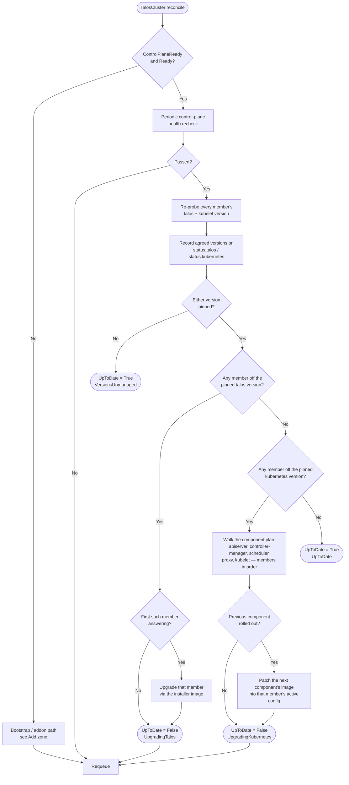

# Upgrade a cluster

A `TalosCluster` pins the Talos and Kubernetes versions its members run:

```yaml
spec:
  talos:
    version: v1.13.0
  kubernetes:
    version: v1.32.0
```

Editing either field is all it takes to upgrade. The `taloscluster`
controller rolls the cluster's members onto the new version one at a time,
waiting for the cluster to be healthy again between each one, and reports
progress on the cluster's own `UpToDate` condition.

## Try it

```sh
export KUBECONFIG=kontinuum.yaml
kubectl patch taloscluster eu-eu-1a -n kontinuum-system --type merge \
  -p '{"spec":{"talos":{"version":"v1.13.1"}}}'
```

Then watch it converge:

```sh
kubectl get taloscluster eu-eu-1a -n kontinuum-system -w
```

The same edit is available from the UI: the cluster detail page's **Upgrade
cluster** button opens a dialog with both version fields, showing what each
one is currently running underneath.

## Rules

### An empty version is unmanaged, not "latest"

Leaving `spec.talos.version` or `spec.kubernetes.version` empty means
kontinuum does not manage that version at all — it will never upgrade a
member toward a version nobody asked for. The controller still needs *some*
version to generate machine configs with, and falls back to its own pinned
default for exactly that, but that default never drives an upgrade.

Clearing a version that was previously set stops kontinuum managing it from
that point on. It does not roll anything back.

### Talos takes precedence over Kubernetes

If a single edit moves both versions, the whole cluster is rolled onto the
new Talos version first, and only then onto the new Kubernetes version. The
Talos version gates which Kubernetes versions are supported at all, and the
installer image carries the kubelet and etcd baselines the new control plane
runs against — upgrading Kubernetes first onto an older Talos can land
outside the supported skew.

### Bootstrap first, upgrade second

Nothing is upgraded until the cluster reports `ControlPlaneReady` **and**
`Ready`, and the periodic control-plane health check has passed on that same
pass. That has two consequences worth knowing:

- A brand-new zone whose seed node booted a different Talos version than
  `kontinuum zone add --talos-version` asked for is **created and
  bootstrapped first**, at whatever version the node booted, and upgraded
  once the cluster comes up. The two never interleave — a half-bootstrapped
  control plane being rebooted into a new installer image is how etcd gets
  lost.
- A member that is mid-upgrade is rebooting, so it's unreachable, so
  nothing else is touched until it is back. There is no separate lock.

An unhealthy cluster — or one whose addons have gone unhealthy, taking
`Ready` down with them — is therefore also a cluster that will not upgrade.
Fix the health problem first.

#### What actually holds the roll to one member

Two gates, because the health check alone does not cover the whole cluster:

- The **control-plane health check** is built from the control-plane
  members only (`ClusterInfo.ControlPlaneNodes`); it never sees a worker.
  A rebooting control-plane member fails it, and the whole pass stops
  before it reaches the upgrade step at all. This is what preserves etcd
  quorum: on a three- or five-member control plane, exactly one is ever
  down.
- A **per-member reachability gate** covers everyone, workers included.
  Each pass already probes every member's version, and a member that does
  not answer is either rebooting into an upgrade it was given or down for
  an unrelated reason. Either way the roll parks on it rather than issuing
  it anything further, and says so on the condition.

The second gate is why a rebooting member reports `UpgradingTalos` and not
`UpgradeFailed`: it is doing exactly what it was asked to, and a reconciler
that re-issued the RPC at it would only collect an error from a node that
is upgrading perfectly well.

### One node at a time, control plane first

Members roll in a fixed order: the control-plane pool's members (sorted by
name), then each worker pool's in spec order. A worker running against a
control plane that hasn't moved yet is fine; the reverse is not.

## Status

Two status fields report what the cluster is actually running, as opposed to
what it has been asked to run:

| Field | Meaning |
| --- | --- |
| `status.talos.version` | The Talos version **every** member reports. Empty while they disagree — i.e. mid-roll — or before anything has been observed. |
| `status.kubernetes.version` | The same, for the Kubernetes version each member's kubelet runs. |

Per-member versions live on each `Instance`: `status.talos.version` and
`status.kubernetes.version`, both visible in `kubectl get instances` and on
the instance detail page.

The `UpToDate` condition ties the two together:

| Reason | Meaning |
| --- | --- |
| `UpToDate` | Every member runs every pinned version. |
| `VersionsUnmanaged` | Neither version is pinned, so there is nothing to converge. |
| `UpgradingTalos` | A member is being upgraded to the pinned Talos version; the message names it and how many are left. |
| `UpgradingKubernetes` | A component is being moved to the pinned Kubernetes version, or has been and is still rolling out; the message names the component and the member. |
| `UpgradeFailed` | The upgrade call itself was refused by a member that *was* reachable. Retried on the next pass — this is not terminal. A member that is merely rebooting reports `UpgradingTalos`/`UpgradingKubernetes` instead. |

## How it works

### Talos

The controller calls Talos's own `Upgrade` API against one member at a time
with `ghcr.io/siderolabs/installer:<version>` — the programmatic equivalent
of `talosctl upgrade`. `preserve` is always set: every cluster kontinuum
bootstraps today is realistically single-node, and a non-preserving upgrade
wipes the ephemeral partition, which on a single-node control plane is that
cluster's only etcd member. Talos's own pre-upgrade checks are left enabled
(no `--force` equivalent).

### Kubernetes

Kontinuum performs the same ordered, component-by-component rollout
`talosctl upgrade-k8s` does.

Each step reads the node's own **active** machine config, points a single
component's image field at the new version, and applies the result with
`NO_REBOOT`. Patching in place is what makes the ordering possible at all:
regenerating the whole config would move every component's image at once,
and `NO_REBOOT` means a Kubernetes upgrade can never reboot a node as a
side effect — if Talos decides a patch needs one, it refuses, and the
refusal surfaces as `UpgradeFailed` instead.

The components move in this order, and a step only begins once the
previous one has been observed to finish:

| Order | Component | Config field | Runs on |
| --- | --- | --- | --- |
| 1 | `kube-apiserver` | `cluster.apiServer.image` | Control plane |
| 2 | `kube-controller-manager` | `cluster.controllerManager.image` | Control plane |
| 3 | `kube-scheduler` | `cluster.scheduler.image` | Control plane |
| 4 | `kube-proxy` | `cluster.proxy.image` | Control plane |
| 5 | `kubelet` | `machine.kubelet.image` | Every member |

The order is the point: an apiserver may run ahead of the components that
talk to it, but a controller-manager, scheduler or kubelet running ahead of
the apiserver is outside the version skew Kubernetes supports. Within a
component, every member is moved — control plane first, by name — before
the next component starts on any of them.

"Observed to finish" means the node itself reports it, read over the Talos
API rather than the workload cluster's:

- A **static pod** counts as rolled out when the node's own
  `StaticPodStatus` shows a container running the new image *and* a true
  `Ready` condition. This is the equivalent of `talosctl upgrade-k8s`'s own
  post-patch wait — if anything the stricter of the two, since it cannot
  pass on a pod that kept its old image.
- The **kubelet** counts as rolled out when its `KubeletSpec` carries the
  new image *and* its service is running and healthy. Both halves matter:
  the service stays "running" across the restart that picks up a new image.
- **kube-proxy** is not waited for. It is a DaemonSet rendered from the
  bootstrap manifests rather than something the patched node runs itself,
  so there is nothing node-local to observe — `talosctl upgrade-k8s` does
  not wait for it either.

Where `talosctl` does all of this inside one blocking call, the controller
spreads it across reconcile passes: one patch, or one wait, per pass, with
the cluster's own health check gating each pass on top. The `UpToDate`
condition names whichever component and member the roll is currently on.

Two details worth knowing:

- **Bootstrap manifests converge on their own.** Talos's own
  `ManifestApplyController` watches the rendered manifests and re-applies
  them whenever the config changes, so CoreDNS and the kube-proxy DaemonSet
  follow the config without kontinuum pushing them. `talosctl upgrade-k8s`
  pushes them itself for immediacy and pruning, not because the mechanism
  needs it.
- **The kubelet's image flavour is preserved.** Talos publishes plain,
  `-slim` and `-fat` kubelet images; an upgrade keeps a node on whichever
  it already runs rather than moving it onto the default.

## Flow chart


```mermaid
flowchart TD
    Start([TalosCluster reconcile]) --> Converged{ControlPlaneReady\nand Ready?}
    Converged -- No --> Bootstrap[Bootstrap / addon path\nsee Add zone]
    Bootstrap --> Requeue[Requeue]

    Converged -- Yes --> Health[Periodic control-plane\nhealth recheck]
    Health --> Healthy{Passed?}
    Healthy -- No --> Requeue

    Healthy -- Yes --> Refresh[Re-probe every member's\ntalos + kubelet version]
    Refresh --> Record[Record agreed versions on\nstatus.talos / status.kubernetes]

    Record --> Pinned{Either version\npinned?}
    Pinned -- No --> Unmanaged([UpToDate = True\nVersionsUnmanaged])

    Pinned -- Yes --> TalosStale{Any member off the\npinned talos version?}
    TalosStale -- Yes --> Reachable{First such member\nanswering?}
    Reachable -- No --> Upgrading([UpToDate = False\nUpgradingTalos])
    Reachable -- Yes --> UpgradeTalos[Upgrade that member\nvia the installer image]
    UpgradeTalos --> Upgrading
    Upgrading --> Requeue

    TalosStale -- No --> K8sStale{Any member off the pinned\nkubernetes version?}
    K8sStale -- Yes --> Plan[Walk the component plan:\napiserver, controller-manager, scheduler,\nproxy, kubelet — members in order]
    Plan --> Parked{Previous component\nrolled out?}
    Parked -- No --> UpgradingK8s([UpToDate = False\nUpgradingKubernetes])
    Parked -- Yes --> Patch[Patch the next component's image\ninto that member's active config]
    Patch --> UpgradingK8s
    UpgradingK8s --> Requeue

    K8sStale -- No --> Done([UpToDate = True\nUpToDate])
```
