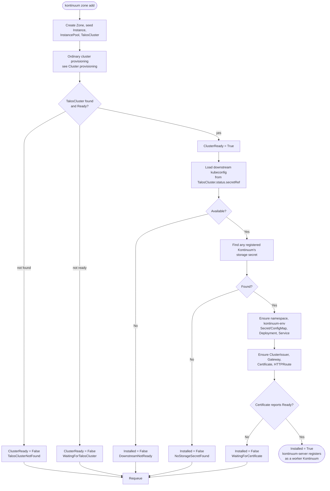

# Add zone

The final phase of the incremental build-out described in
[issue #24](https://github.com/nicklasfrahm-dev/kontinuum/issues/24):
`kontinuum zone add` fans a new zone out into four hub-side objects, and
once that zone's own [`TalosCluster`](cluster-provisioning.md) reports
`Ready`, the `zone` controller installs kontinuum's own footprint onto that
downstream cluster — closing the loop by registering that zone's own
`kontinuum-server` back into the hub as a worker
[`Kontinuum`](../architecture.md#domain-controllers-pkgdomain).

See [#27](https://github.com/nicklasfrahm-dev/kontinuum/issues/27) and
[#28](https://github.com/nicklasfrahm-dev/kontinuum/issues/28) for the two
prior phases this one depends on, and
[#29](https://github.com/nicklasfrahm-dev/kontinuum/issues/29) for this
phase's own scope.

## Try it

The hub needs `KONTINUUM_SERVER_DNS_DOMAIN` set once (e.g. in its own
`compose.yaml`/environment) — `zone add` never passes a domain itself, it
infers it from any already-registered `Kontinuum`'s published config, the
same way it infers the storage connection string (see
[Configuration](../reference.md#zones)):

```sh
export KUBECONFIG=kontinuum.yaml
kontinuum zone add --region eu --zone eu-1a --talos-address 10.0.0.5 --wait
```

Fans out a new zone's hub-side objects and, once its `TalosCluster` is bootstrapped, installs and exposes that zone's own kontinuum-server at `eu-1a.eu.example.com` (assuming the hub's `KONTINUUM_SERVER_DNS_DOMAIN` is `example.com`). See [Configuration](../reference.md#zones) for `KONTINUUM_ACME_EMAIL`/`KONTINUUM_ACME_SERVER`, which the `zone` controller needs to issue that certificate.

## Stages

1. **Fan-out** (`kontinuum zone add`, `pkg/domain/zone`'s shared
   `BuildAddObjects`/`Add`) — creates four hub-side objects, all sharing
   one name, `<region>-<zone>`, except the seed `Instance` (`-seed`
   suffixed, since `Instance` is a distinct Kind with no naming collision
   risk): a `Zone`, the seed `Instance` (`spec.interfaces` from
   `--talos-address`, labeled `kontinuum.sh/region`/`kontinuum.sh/zone`), a
   `replicas: 1` `InstancePool` selecting that `Instance` by those same
   labels, and a `TalosCluster` whose control plane references that pool.
   This is the same shared naming convention `Addon` objects already assume
   (`<cluster>-<releaseName>` — see `pkg/domain/addon/resources.go`), and
   it's what lets the `zone` controller find "its" `TalosCluster` by name
   alone, with no extra reference field.
2. **Cluster bootstrap** — ordinary [cluster provisioning](cluster-provisioning.md):
   `InstancePool` claims the seed `Instance`, `TalosCluster` bootstraps a
   single-node control plane and seeds its built-in addons (Cilium, the
   standard Gateway API CRDs, and cert-manager — see that page for why all
   three are guaranteed present by the time `TalosCluster.status.Ready` is
   true).
3. **Downstream install** (`pkg/domain/zone`'s `Reconciler`) — once
   `ClusterReady`, builds a client against the zone's own cluster (from the
   kubeconfig `TalosCluster.status.secretRef` points at) and installs, in
   order: the `kontinuum-system` namespace; a `kontinuum-env`
   Secret/ConfigMap; the `kontinuum` Deployment/Service; a cert-manager
   `ClusterIssuer`; a `Gateway`; a `Certificate`; and an `HTTPRoute` —
   exposing that zone's own kontinuum-server at
   `<zone>.<region>.<domain>`. `Installed` only flips `True` once
   cert-manager's own `Certificate` reports `Ready` — a real signal that
   TLS issuance actually succeeded, not just that the object was created.

## Details

### How the new zone's storage credentials travel, without ever touching the CLI

A zone's `kontinuum-server` only "closes the loop" — registering itself as
a worker `Kontinuum` the hub can see — if it's pointed at the *same*
storage backend the hub itself uses (see issue #24's architecture: storage
is a property of the deployment, not of role). Rather than have the
operator pass a raw connection string through `zone add`, the `zone`
controller finds it itself: **every** registered `Kontinuum` — hub or
worker, it doesn't matter which — already upserts its own storage
connection string into a Secret on every heartbeat
(`status.secretRef`, see `pkg/domain/registry/heartbeat.go`). The `zone`
controller lists existing `Kontinuum`s, picks one (name-sorted, for
determinism), reads that Secret, and copies the value into the new zone's
own `kontinuum-env` Secret. There is always at least one to find — the hub
always self-registers — so this never needs bootstrapping.

### TLS: ACME over the Gateway API, not Ingress

The `ClusterIssuer` the `zone` controller creates uses ACME (Let's
Encrypt, configured via the hub's own `KONTINUUM_ACME_EMAIL`/
`KONTINUUM_ACME_SERVER`) with an HTTP-01 challenge solved through the
Gateway API (`solvers[].http01.gatewayHTTPRoute`), not the older
Ingress-based solver — this repo has no Ingress controller anywhere, and
Cilium (already installed as a built-in addon with `gatewayAPI.enabled:
true`) implements Gateway API directly. The `Gateway` the controller
creates has two listeners for exactly this reason: a plain HTTP one (port
80, no hostname restriction) that cert-manager attaches its own ephemeral
challenge `HTTPRoute` to, and an HTTPS one (port 443) terminating TLS from
the `Certificate`'s own secret.

The `Gateway`'s `gatewayClassName` is `"cilium"` — assumed already present
on the downstream cluster from Cilium's own chart, not created by this
controller. This is an unverified assumption worth checking with `kubectl
get gatewayclass cilium` against a real added zone; if it's ever missing,
the `Gateway` simply never reports `Accepted`, which is a visible, easy to
diagnose failure rather than a silent one.

### No teardown yet

Deleting a `Zone`/`TalosCluster` today only removes the hub-side objects —
the downstream cluster's `kontinuum-system` namespace and everything in it
is left in place. A cross-cluster owner reference isn't possible (the
owner lives on the hub's own apiserver; the objects it "owns" live on a
completely different apiserver), so real garbage collection can't do this
for free the way it does for same-cluster owner references. See
[issue #49](https://github.com/nicklasfrahm-dev/kontinuum/issues/49) for
the planned follow-up: a finalizer-driven downstream cleanup, plus a Talos
`Reset` of the seed node so it returns to maintenance mode and can be
re-added elsewhere.

## Flow chart


