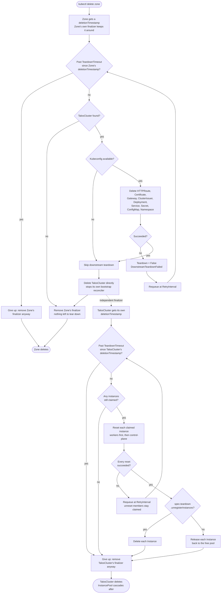

# Remove zone

The teardown counterpart to [Add zone](zone-add.md): deleting a `Zone`
tears down everything `zone add` installed onto that zone's own downstream
cluster, then resets its instances back to Talos maintenance mode so they
can be discovered and claimed by a different (or the same) zone later with
no manual intervention — by default, those instances stay in your
inventory; see [Keeping vs. unregistering instances](#keeping-vs-unregistering-instances)
below for the opt-in that actually removes them.

Ownership is a strict chain, not four objects all owned directly by
`Zone`: `Zone` owns `TalosCluster`, `TalosCluster` owns `InstancePool`, and
`Instance` is owned by nobody — its fate is always the explicit opt-in
above, never inferred from garbage collection. Two independent finalizers
drive this, one per link that actually does real work on the way out:
`Zone`'s own (tears down the downstream cluster's footprint, a
cross-cluster operation Kubernetes garbage collection has no way to
express on its own) and `TalosCluster`'s own (resets, then releases or
deletes, every instance it still has claimed — see
[Details](#details) below for why this lives here and not on `Zone`).

## Try it

```sh
export KUBECONFIG=kontinuum.yaml
kubectl delete zone eu-eu-1a
```

`kubectl delete` blocks until `Zone`'s own finalizer clears — that's
expected: the `zone` controller is tearing down the downstream cluster's
footprint in the background, and `TalosCluster`'s own finalizer is
independently resetting instances alongside it. Watch progress with:

```sh
kubectl get zone eu-eu-1a -o jsonpath='{.status.conditions}' -w
kubectl get instance -l kontinuum.sh/region=eu,kontinuum.sh/zone=eu-1a -w
```

## Stages

1. **Downstream teardown** (`pkg/domain/zone`'s `Reconciler`, same
   downstream client this package's own [Add zone](zone-add.md) install
   path builds from `TalosCluster.status.secretRef`) — deletes, in exactly
   the reverse of install order: the `HTTPRoute`, `Certificate`, `Gateway`,
   and cluster-scoped `ClusterIssuer`; then the `kontinuum` Deployment/
   Service and `kontinuum-env` Secret/ConfigMap; and finally the
   `kontinuum-system` namespace itself. Deleting the namespace last cascades
   away anything not explicitly listed here too (e.g. cert-manager's own
   TLS Secret). Every step is idempotent — safe to retry, and safe if a
   previous attempt got partway through.
2. **`TalosCluster` deletion** — once downstream teardown succeeds (or was
   safely skipped, see [Details](#details)), `Zone`'s own reconciler
   deletes the `TalosCluster` directly, rather than leaving it for garbage
   collection: this sets its `deletionTimestamp` immediately, which stops
   `TalosCluster`'s own bootstrap reconciler from fighting the reset in
   stage 3 below (observed for real, before this ordering existed: a reset
   node came back up in maintenance mode and got reconfigured back into the
   cluster within about a minute).
3. **`Zone`'s own finalizer removal** — with both stages above done,
   `Zone`'s own finalizer comes off, letting `Zone` finish deleting. This
   does **not** wait for stage 4 below to finish — that's `TalosCluster`'s
   own finalizer, running independently on its own timeout.
4. **Instance reset, release, or unregister** (`TalosCluster`'s own
   finalizer, `pkg/domain/taloscluster`'s `reconcileTeardown` in
   `teardown.go`) — for every instance still claimed by the deleted
   cluster's control-plane or worker pools (workers first, then
   control-plane, since a worker reset dials through a live control-plane
   member): issues a graceful `Reset` (wipe + reboot) through the same
   `ClusterBootstrapper` seam `TalosCluster`'s own bootstrap reconciler
   uses, clears its now-stale `Configured`/`Joined`/`Ready` conditions,
   then either releases its claim (default) or deletes it outright
   (`spec.teardown.unregisterInstances: true`). Once no claimed instances
   remain, this finalizer comes off too, letting garbage collection cascade
   `InstancePool`'s own deletion (whose own finalizer, by then, finds
   nothing left claimed and removes itself immediately).

## Keeping vs. unregistering instances

Instances are physical inventory, not scratch state — by default,
`zone add`'s own `--unregister-instances-on-delete` flag (or the "Add
zone" form's "Unregister instances on decommissioning" checkbox) is unset,
and stage 4 above only resets and releases an instance: it goes back to
Talos maintenance mode, unclaimed, and shows up `Discovered` again in
`kubectl get instance` — ready for a future `zone add` to claim it, with no
manual re-registration. Set that flag when adding a zone if you actually
intend to decommission its hardware for good; that instance is then
deleted from inventory as part of the same stage 4 reset, instead of just
released.

This is set once, at `zone add` time, on the created `TalosCluster`'s own
`spec.teardown.unregisterInstances` — not something `zone remove` itself
prompts for — since it's `TalosCluster`'s own finalizer, not `Zone`'s, that
reads it. Deleting a `TalosCluster` directly (bypassing its owning `Zone`
entirely) honors the exact same setting, the exact same way.

## Details

### A zone that never finished joining

Stage 1 is skipped, not retried, when there's no kubeconfig to load —
either the zone's `TalosCluster` never bootstrapped that far, or its
Secret is already gone: nothing reachable to tear down, so this reports
success, not an error. Stage 4 skips resetting (but still releases or
deletes, per the setting above) any instance that was never actually
configured — nothing was ever installed on it, so there's nothing to
reset.

### When the downstream cluster is unreachable

Hardware pulled, network gone, or anything else that makes the downstream
cluster genuinely unreachable shows up as stage 1 failing, not as a silent
skip. `Zone.status.conditions[Teardown]` is set `False`, with a message
naming the failure and the deadline teardown is retrying against:

```
downstream teardown not yet complete: failed to build downstream client
for "eu-eu-1a": dial tcp 10.0.0.5:6443: connect: connection refused —
will keep retrying until 2026-08-09T22:30:00Z, after which the finalizer
is removed automatically; see docs/workflows/zone-remove.md to force this
sooner
```

Reconcile keeps retrying, on the same interval every other reconcile in
this repo uses, until that deadline — fifteen minutes after the `Zone`'s
own `deletionTimestamp` by default. Past it, teardown gives up
automatically and removes `Zone`'s own finalizer anyway, rather than
blocking its deletion forever — a finalizer with no bound would leave a
delete hanging indefinitely against hardware that's genuinely never coming
back. Automatic give-up means the downstream cluster's footprint (if it
still exists somewhere reachable) is left exactly as it was — nothing is
silently discarded, but nothing further is attempted either.

`TalosCluster`'s own finalizer (stage 4) has its own, independent
fifteen-minute timeout from its own `deletionTimestamp`, with the same
"not a finalizer that blocks deletion forever" rationale: a member whose
own reset genuinely can't succeed (hardware pulled, network gone) doesn't
block the rest of the cluster's instances from being released, or the
`TalosCluster` object itself from finishing deletion.

### Operator escape hatch: forcing removal sooner

An operator who has already confirmed the hardware is gone for good — no
need to wait out the timeout — can remove the relevant finalizer directly.
For downstream teardown (stage 1-3):

```sh
kubectl patch zone eu-eu-1a --type=merge -p '{"metadata":{"finalizers":[]}}'
```

If instance reset (stage 4) is what's stuck instead — `TalosCluster` is
gone but `kubectl get instance` still shows claimed instances that were
never released — patch the `TalosCluster` itself the same way (it may
already be gone by the time you look, in which case there's nothing left
to patch: its own finalizer already gave up or succeeded):

```sh
kubectl patch talosclusters.kontinuum.sh eu-eu-1a --type=merge -p '{"metadata":{"finalizers":[]}}'
```

Either forces that object to finish deleting immediately, exactly as if
its own teardown had timed out on its own. Only use this once you've
independently confirmed the downstream cluster and/or affected instances
don't need — or can't receive — the cleanup stages above; kontinuum has no
way to verify that for you once you've forced past its own retry loop.

## Flow chart


