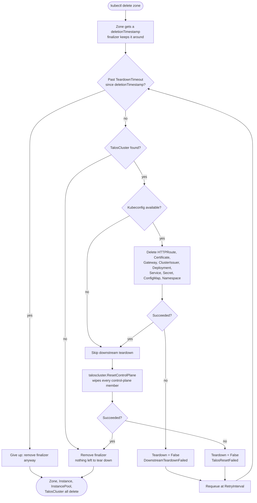

# Remove zone

The teardown counterpart to [Add zone](zone-add.md): deleting a `Zone`
tears down everything `zone add` installed onto that zone's own downstream
cluster, then resets its seed node back to Talos maintenance mode so it can
be discovered and joined into a different (or the same) zone later with no
manual intervention.

A cross-cluster owner reference from the hub's `Zone` to objects living on
the zone's own downstream cluster isn't possible — the owner lives on the
hub's own apiserver, the objects it "owns" live on a completely different
one — so Kubernetes garbage collection can't cascade-delete this the way it
does for same-cluster owner references. A finalizer on `Zone`, added the
first time it's ever reconciled, is the only mechanism that runs at all.

## Try it

```sh
export KUBECONFIG=kontinuum.yaml
kubectl delete zone eu-eu-1a
```

`kubectl delete` blocks until the finalizer clears — that's expected: the
`zone` controller is tearing down the downstream cluster's footprint and
resetting its seed node in the background. Watch progress with:

```sh
kubectl get zone eu-eu-1a -o jsonpath='{.status.conditions}' -w
```

## Stages

1. **Downstream teardown** (`pkg/domain/zone`'s `Reconciler`, same
   downstream client this package's own [Add zone](zone-add.md) install
   path builds from `TalosCluster.status.secretRef`) — deletes, in exactly
   the reverse of install order: the `HTTPRoute`, `Certificate`, `Gateway`,
   and cluster-scoped `ClusterIssuer`; then the `kontinuum` Deployment/
   Service and `kontinuum-env` Secret/ConfigMap; and finally the
   `kontinuum-system` namespace itself. Deleting the namespace last cascades
   away anything not explicitly listed here too (e.g. cert-manager's own
   TLS Secret). Every step is idempotent — safe to retry, and safe if a
   previous attempt got partway through.
2. **Talos Reset** (`pkg/domain/taloscluster`'s `ResetControlPlane`, dialing
   through the same `ClusterBootstrapper` seam `TalosCluster`'s own
   bootstrap reconciler uses) — issues a graceful `Reset` (wipe + reboot)
   against every discovered member of the zone's control-plane
   `InstancePool`, returning the underlying bare-metal node(s) to
   maintenance mode. Only reached once downstream teardown has actually
   succeeded (or was safely skipped — see below): a reset node can no
   longer serve the kubeconfig-based teardown step, so this always runs
   second.
3. **Finalizer removal** — once both stages above succeed, the finalizer
   comes off, letting the `Zone` (and, via ordinary hub-side garbage
   collection now that nothing downstream depends on them, the `Instance`/
   `InstancePool`/`TalosCluster` it owns) actually delete.

## Details

### A zone that never finished joining

Stage 1 is skipped, not retried, when there's no kubeconfig to load —
either the zone's `TalosCluster` never bootstrapped that far, or its
Secret is already gone. Stage 2 is skipped the same way when no secrets
bundle was ever persisted, or no control-plane member was ever discovered.
Both report success, not an error: there's nothing reachable to tear down
or reset either way, so the finalizer comes off immediately.

### When the downstream cluster is unreachable

Hardware pulled, network gone, or anything else that makes the downstream
cluster genuinely unreachable shows up as stage 1 failing, not as a silent
skip. `Zone.status.conditions[Teardown]` is set `False`, with a message
naming the failure and the deadline teardown is retrying against:

```
downstream teardown not yet complete: failed to build downstream client
for "eu-eu-1a": dial tcp 10.0.0.5:6443: connect: connection refused —
will keep retrying until 2026-08-09T22:30:00Z, after which the finalizer
is removed automatically; see docs/workflows/zone-remove.md to force this
sooner
```

Reconcile keeps retrying, on the same interval every other reconcile in
this repo uses, until that deadline — fifteen minutes after the `Zone`'s
own `deletionTimestamp` by default. Past it, teardown gives up
automatically and removes the finalizer anyway, rather than blocking the
`Zone`'s deletion forever — a finalizer with no bound would leave a delete
hanging indefinitely against hardware that's genuinely never coming back.
Automatic give-up means the downstream cluster's footprint (if it still
exists somewhere reachable) and the seed node (if it's still running and
joined) are left exactly as they were — nothing is silently discarded, but
nothing further is attempted either.

### Operator escape hatch: forcing removal sooner

An operator who has already confirmed the hardware is gone for good — no
need to wait out the timeout — can remove the finalizer directly:

```sh
kubectl patch zone eu-eu-1a --type=merge -p '{"metadata":{"finalizers":[]}}'
```

This immediately lets the `Zone` (and its owned `Instance`/`InstancePool`/
`TalosCluster`) finish deleting, exactly as if teardown had timed out on its
own. Only use this once you've independently confirmed the downstream
cluster and/or seed node don't need — or can't receive — the cleanup stages
above; kontinuum has no way to verify that for you once you've forced past
its own retry loop.

## Flow chart


